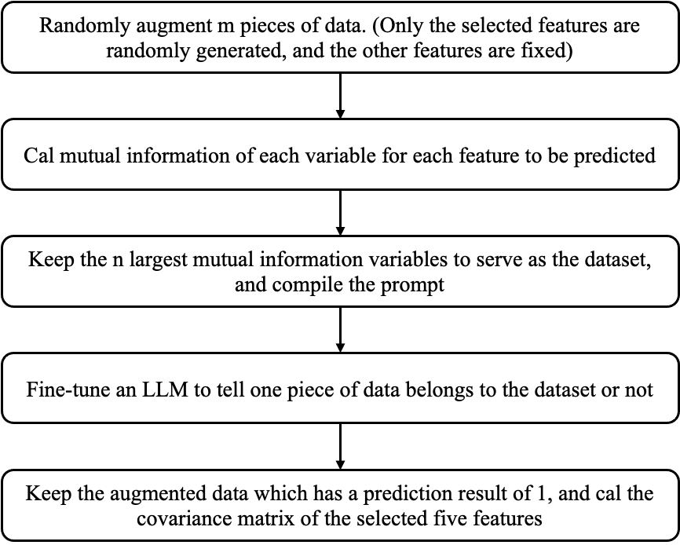

## LLM Augmentation
This project aims to augment social survey data using LLMs. We utilize LLMs to generate reasonable data, thereby enhancing the volume of a specific social survey dataset.
We don't have a precise criterion to judge whether the augmented data is reasonable. Currently, the plan is to measure the consistency between the covariance of the generated data and the covariance of the existing data.

### Related Literature
Few literature has focused on the augmentation of social survey data. This project gets the insight from a missing-values imputation work, [IPM](https://ieeexplore.ieee.org/document/9458712).
In this paper, to improve the performance of an imputation model fine-tuned based on Bert, the researchers use neighbor-based imputation methods to generate a set of candidates first, and then fine-tune a model to predict whether the candidate is the correct prediction or not.

### Work Flow

### Performance
Highest Accuracy: 68.29% (30 features, 2 epochs, lr=5e-4)

### To-Dos
[ ] Use regression task instead of binary and consider the distance of one augmented data from the original one
